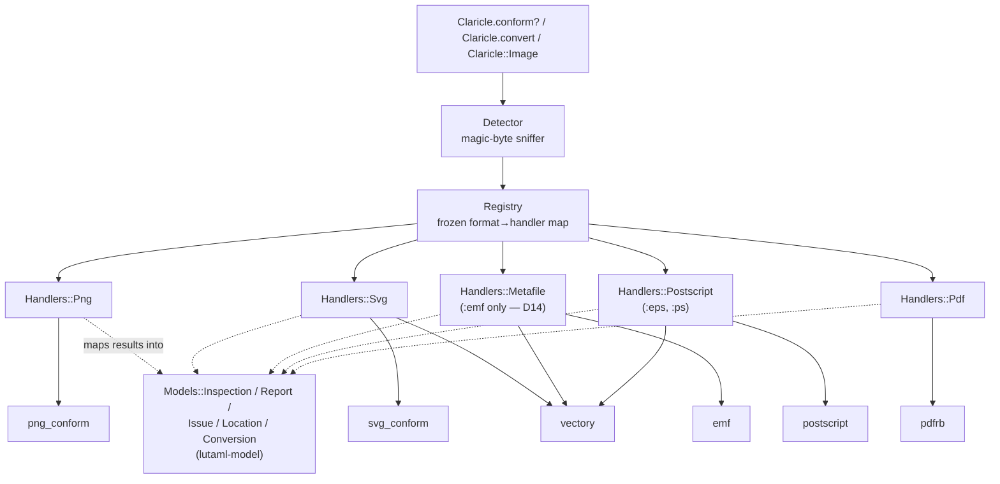
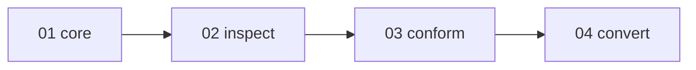

# Claricle Unified Library Plan

**Date**: 2026-08-11. Restructured from the reviewed single-file plan
(git history: `docs/plans/issue-1-unified-library.md`, removed in this
restructure — these files are self-contained).
**Goal**: turn `claricle` from a placeholder shim into the real umbrella
library for issue #1 — one Ruby API and one CLI providing **inspect**,
**conformance check**, and **conversion** over PNG, SVG, EMF/WMF, PS/EPS,
and PDF, delegating to the org's specialist gems.

> Local working docs under `docs/plans/*` live only on the maintainer's
> machine and are never committed. The plan files here are the
> authoritative, self-contained copy.

## Architecture

Every handler is a plain subclass declaring its formats once; the
registry derives a frozen map from one class list. Adding a format =
one handler class + one entry in `Registry::HANDLER_CLASSES`.

## Item topology

Strictly sequential — each item is an independently green, shippable
PR building on the previous one. 04 depends on 03 because the CLI
batch helper is built in 03 and reused verbatim in 04.

## Items

| # | Item | Delivers | Can start |
|---|------|----------|-----------|
| 01 | Core | errors, models, detector, registry, `Image`, CLI runner + exit codes, stub removal, Ruby 3.2 floor, honesty baseline | now |
| 02 | Inspect | five handlers' `inspection`, `claricle inspect`, `claricle formats`, `--json` | after 01 + verification gate |
| 03 | Conform | five conformance mappings, `Claricle.conform?`, `claricle conform`, batch helper, `--strict` | after 02 |
| 04 | Convert | vectory-backed conversion, lossiness classification, `claricle convert`, README rewrite | after 03 |

## Contracts falsified by execution (2026-08-12)

An adversarial Claude+Codex round ran the installed delegates instead of
reading them. Six "verified" facts in the earlier plan were false. They
are recorded here because the plan asserted them confidently, and the
same mistake is easy to repeat.

| Claim the plan made | What running it showed |
|---|---|
| `Emf.detect_format` returns `:emf`/`:wmf`/nil, never raises | Raises `Emf::FormatError` on **every** unrecognised input — empty, short, plain text, XML, PNG bytes. Never returned nil in five trials |
| WMF inspect + conform work through `emf` | `Emf.parse` on WMF bytes raises `WMF parser not yet implemented` in released 0.1.0 |
| png_conform gives `error_type`, chunk and offset | `validate_file` → `result_builder#add_context_messages` passes only `e[:message]`. Type, chunk and offset are all dropped |
| svg_conform's `type` carries severity | `ErrorTracker#add_error` hardcodes `type: :error` and keeps real severity in a separate field. Mapping from `type` flattens info and warning into error |
| A 4096-byte binary `<svg` regex is XML-tolerant | vectory accepts UTF-16LE+BOM, `<s:svg>` prefixed roots, internal DTD subsets, and a root at byte 5028. The regex matched none of the last three |
| SVG→EMF is the lossy direction (emfsvg "lossy matcher") | That phrase describes a 0.1px **comparison tolerance**, not a lossy direction. Issue #1 names EMF→SVG as the one that drops semantics |

Two delegates — `postscript` and `pdfrb` — are **not installed in any
local gemset**, so nothing about them has ever been verified. See the
verification gate below.

## Verification gate (blocks item 02)

Before item 02 registers any PostScript or PDF capability: resolve exact
versions in a clean bundle, run valid and malformed fixtures through
them, record the real callable surface and the shapes they return and
raise, then amend this plan. Both formats stay in v1 scope; if the gate
cannot pass, v1 is blocked rather than quietly weakened. Every delegate
contract in the item files is an assumption until executed — mark it
⚙ and run it before writing a spec against it.

## Decisions of record (Claude + Codex consensus, 2026-08-10, revised 2026-08-12)

Sixteen decisions. Six deviate from the issue text and need sign-off
from the issue author before their behavior ships — post them as an
issue #1 comment at the start of implementation.

| # | Decision | Status |
|---|----------|--------|
| D1 | Four vertical-slice PRs; every item documents the commands and API it ships in README.adoc as part of that PR; 04 does the full rewrite | settled |
| D2 | `Image#inspect` → `Image#inspection` (`Object#inspect` stays Ruby's debugging protocol; no module-level facade — it would shadow `Module#inspect`) | **needs issue sign-off** |
| D3 | Plain handler subclasses + `formats` declaration macro; frozen derived registry, no runtime mutation, no self-registration | settled |
| D4 | All unified models are lutaml-model classes; `lutaml-model ~> 0.8` is a direct dependency. Model invariants (severity enum, non-nil message) are enforced at construction **and** deserialization — lutaml-model 0.8.19 accepts a bogus enum until `validate!` runs. `Report#valid` is derived, not stored, so appending an issue can't leave it stale | settled |
| D5 | Hard deps on all delegates; Ruby floor **3.2** (pdfrb); `libpng` dropped (FFI codec, no v1 operation needs it). Heavy gems required lazily inside handlers; `emf` (bindata-only, powers the detector) is the sole eager require | **needs issue sign-off** |
| D6 | Keep Thor; `Runner` wraps `Cli.start(argv, debug: true)` and maps errors → exit codes (matrix below) | settled |
| D7 | Hand-rolled detector (no marcel): PNG signature, `%PDF-`, `%!PS` + `EPSF` first-line split, `Emf.detect_format` **wrapped in a `rescue Emf::FormatError`** so an unrecognised file continues to the next probe, and encoding-aware XML root detection for SVG — decode the BOM/declaration, resolve the root QName, require the SVG namespace, and disable external entity and DTD expansion (XXE). The 4096-byte binary regex is dropped as proven insufficient | settled |
| D8 | Tri-state `valid`, decided in order: any `error` → `no`; else any `warning` → `suspicious`; else (`info` only, or no issues at all) → `yes`. `info` never downgrades validity. Non-strict `conform?` passes `yes` AND `suspicious`; `--strict`/`strict:` requires `yes` | settled |
| D9 | Conversion via vectory only: EMF↔SVG, PS/EPS↔SVG, SVG→EPS/PS. PNG/PDF inspect+conform only. EMF+ surfaces as inspection metadata (the released EMF+ parser is unimplemented, so its payload is never validated — say so rather than implying coverage) | settled |
| D10 | Lossiness = static per-edge enum `:lossless/:lossy/:unknown`. **EMF→SVG starts `:lossy`** — issue #1 names it as dropping metafile semantics. SVG→EMF starts `:unknown`. Every other edge is `:unknown` until edge-specific fixtures justify better. Lossy/unknown warn on stderr and carry the classification in the result; no consent-gate flag | settled |
| D14 | **WMF leaves v1 entirely.** Released `emf` 0.1.0 raises `WMF parser not yet implemented`, so no WMF operation can ship. The detector still recognises `:wmf`; no handler registers it, so it raises `UnsupportedFormat` → exit 3, which is the honest answer. Issue #1's acceptance checklist does not require WMF | **needs issue sign-off** |
| D15 | Dimension semantics are unresolved and must be settled before item 01 freezes the model. Running the delegates: an SVG of `2.54cm × 1.27cm` with `viewBox="0 0 96 48"` reports `3×1` as SVG and `96×48` as EPS; `100% × 50%` with `viewBox="0 0 300 200"` reports `100×50` and `300×200`. EMF exposes device bounds, physical frame and device pixels separately. Naked `width`/`height` are therefore ambiguous and "dimension preservation" is undefined | **needs issue sign-off** |
| D16 | PDF conformance scope is undecided pending the verification gate. Issue #1 asks for Arlington predicates; whether released `pdfrb` exposes a general Arlington runner is unverified. No PDF profile or `Conformance::*` surface is planned until the gate reports what exists | **needs issue sign-off** |
| D11 | Round-trip narrowed: byte-identical A→B→A across formats NOT promised (vectory's own specs are semantic); same-format parse→serialize identity where the delegate guarantees it, semantic checks for conversions | **needs issue sign-off** |
| D12 | Batch: positional `FILE...` values are **literal paths**; globbing needs an explicit `--pattern` (a filename may legally contain glob characters, and an unquoted glob is expanded by the shell before Claricle sees it). `Dir.glob(pattern).sort`; zero matches → 2; failures don't stop the batch; exit = highest code. Every batch-capable JSON output is **always an array**, including a single result. Each slot is one `Models::BatchItem{path, status, exit_code, result, error}` envelope — never a mixed `Report`/failure array, so `jq '.[].result.valid'` can't silently return null for an operational failure. `--output` single-source only; derived names, `--force` to overwrite; `--output -` = bytes-only stdout, rejects `--json`. ONE batch helper (built in 03, reused in 04) | settled |
| D13 | Constrain against released delegate versions and **stop calling `~>` a pin** — `~> 0.7` admits every 0.x below 1.0, and this gem commits no lockfile, so a clean build can install an unreviewed API. Use three-segment constraints on the reviewed line. Version floors are stated once, in the item that adds the dependency; D4 does not restate them | settled |

## Exit codes (all commands)

| Code | Meaning |
|------|---------|
| 0 | success / conformance passed |
| 1 | conformance failed (issues found) |
| 2 | invocation error (bad args, file not found) |
| 3 | unsupported format or conversion |
| 4 | internal error / parser crash |

Mapping rules the runner must honor: a dedicated `InvocationError` maps
to 2 — do not blanket-map `ArgumentError`, since a delegate's accidental
`ArgumentError` is an internal defect, not bad user input. `LoadError`
maps to 4 and must be caught explicitly, because `ScriptError` is not a
`StandardError` and would otherwise escape as process status 1 — the
status reserved for nonconformance. Each delegate gets an allowlist of
expected malformed-input exceptions, per operation and per stage.
**What an allowlisted failure means depends on the operation**: under
`conform` it is nonconformance and exits 1; under `inspect` it is
`parse_status: :failed` and exits 0, because reporting that a file
doesn't parse is a successful inspection. Anything off the allowlist is
an unexpected fault and exits 4 under either. Without that list, 1
versus 4 is decided by which delegate happens to report via a return
value and which via an exception. `Runner.run` returns an integer; only
`exe/claricle` calls `exit`. Nothing raises `SystemExit` through the
runner.

## Format × operation target matrix

| Format | Inspect | Conform | Convert to |
|--------|---------|---------|------------|
| png | 02 | 03 | — |
| svg | 02 | 03 | emf, eps, ps (04) |
| emf | 02 | 03 | svg (04) |
| wmf | — | — | — (D14: recognised, never handled, exit 3) |
| eps / ps | 02 † | 03 † | svg (04) † |
| pdf | 02 | 03 | — |

† EPS/PS and PDF rows are provisional until the verification gate runs —
their delegates have never been executed. WMF is a deliberate hole per
D14, not an oversight.

Only the D9-verified edges ship in v1 (EMF↔SVG, PS/EPS↔SVG,
SVG→EPS/PS); vectory offers more pairs, but unexposed edges stay out
until fixture evidence justifies them.

**`capabilities` tracks what has shipped, never what is planned.** A
handler declares an operation in the same commit that implements it, so
`claricle formats` is truthful at every commit — including the commits
inside an item, not just at item boundaries. 02 declares `inspect`
only; 03 adds `conform` handler by handler; 04 adds `convert` plus each
handler's target list. The `formats` output spec moves with the
declarations, since the command's expected output changes when
capabilities do.

## Acceptance criteria → items

- [ ] `Claricle::Image.from_path(...).inspection` for PNG, SVG, EMF, PS/EPS, PDF → 02 (WMF removed per D14)
- [ ] `Claricle.conform?` delegates for all five formats → 03
- [ ] `Claricle.convert` covers EMF↔SVG, PS/EPS↔SVG, SVG→EPS → 04
- [ ] CLI inspect/conform/convert, human + JSON → 02/03/04
- [ ] `claricle formats` support matrix → 02 (command, inspect only), grows in 03 and 04, complete at 04
- [ ] Handler registry documented; adding a format = one handler class → 01 (code), 04 (README)
- [ ] Exit codes match the matrix → 01 (runner, all rows incl. 4), verified per command in 02/03/04; 03 reaches 4 end-to-end
- [ ] Conformance specs on canonical fixtures; round-trip specs per D11 → 03/04
- [ ] `compress` stub removed → 01
- [ ] README.adoc, gemspec and RBS truthful → 01 (full baseline), extended per item, final rewrite 04

Promises with no owner, needing sign-off or an owner before 04 can claim
the checklist is satisfiable: issue #1 names `Claricle.detect(io)` while
01 defines only `Detector.detect(bytes)`/`detect_path`; the byte **range**
the issue asks for needs `offset + length`, not a bare offset; generic
PDF Arlington conformance is unproven (D16); EMF+ payload conformance has
no implementation; cross-format round trips are narrowed by D11.

## Global constraints (every item)

- Ruby >= 3.2; CI matrix `['3.2', '3.3']`; RuboCop `TargetRubyVersion: 3.2`.
  The gemspec admits Ruby 3.4+, so CI should cover the newest stable line
  it actually allows.
- Claricle's own code is pure Ruby; delegates are not (vectory pulls in
  Nokogiri, a native extension). The issue's "to the extent possible"
  governs.
- `frozen_string_literal: true` in every file; RuboCop clean;
  `bundle exec rake` (spec + rubocop) green at every commit.
- lutaml-model for every model — no hand-rolled `to_h`/`from_h`.
- Real specs, no `double()`; fixtures from the delegates' canonical corpora.
- Commit subjects: one line, under 10 words.
- Every item passes the full Pre-Push Review Chain before push
  (thermo-nuclear → dependency-contract-check → execution-diff → Codex → copilot-review).
- Out of scope entirely: compression, rendering/rasterization, editing,
  `arroolio`, WMF conversion, `libpng`, gem release (maintainer-driven, post-04).
