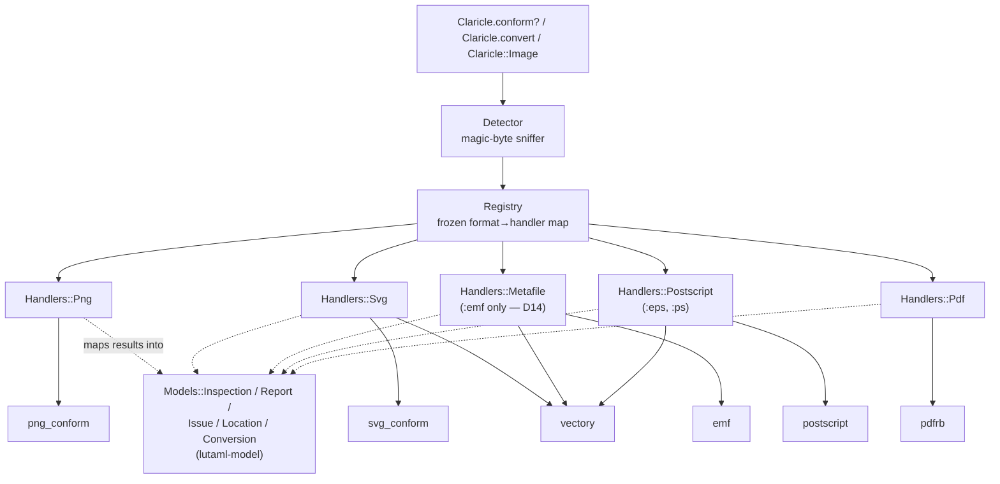
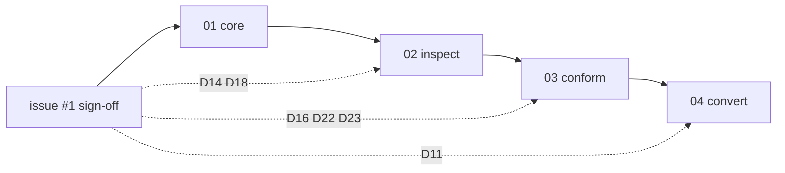

# Claricle Unified Library Plan

**Date**: 2026-08-11. Restructured from the reviewed single-file plan
(git history: `docs/plans/issue-1-unified-library.md`, removed in this
restructure — these files are self-contained).
**Goal**: turn `claricle` from a placeholder shim into the real umbrella
library for issue #1 — one Ruby API and one CLI providing **inspect**,
**conformance check**, and **conversion** over PNG, SVG, EMF/WMF, PS/EPS,
and PDF, delegating to the org's specialist gems.

> Local working docs under `docs/plans/*` live only on the maintainer's
> machine and are never committed. The plan files here are the
> authoritative, self-contained copy.

## Architecture



Every handler is a plain subclass declaring its formats once; the
registry derives a frozen map from one class list. Adding a format costs
one handler class, one entry in `Registry::HANDLER_CLASSES`, one probe
in the detector — detection is a hand-rolled sequence, not a per-handler
sniffer — and, for an inbound conversion, an entry in the source
handler's target list together with its feature-loss rules.

## Item topology

Strictly sequential — each item is an independently green, shippable
PR building on the previous one. 04 depends on 03 because the CLI
batch helper is built in 03 and reused verbatim in 04.



## Decision gates

No decision blocks implementation — all twenty-four are settled. Items
run in sequence for the ordinary reason that each builds on the last.

The seven reported narrowings are posted to issue #1 for visibility. If
the author objects to one, the affected item is revisited then; we do
not hold work waiting for a response to a report.

## Items

| # | Item | Delivers | Can start |
|---|------|----------|-----------|
| 01 | Core | errors, models, detector, registry, `Image`, CLI runner + exit codes, stub removal, Ruby 3.2 floor, honesty baseline | now |
| 02 | Inspect | five handlers' `inspection`, `claricle inspect`, `claricle formats`, `--json` | after 01 |
| 03 | Conform | conformance mappings for png/svg/emf/pdf, `--profile`, `Claricle.conform?`, `claricle conform`, batch helper, `--strict` | after 02 |
| 04 | Convert | vectory-backed conversion, lossiness classification, `claricle convert`, README rewrite | after 03 |

## Contracts falsified by execution (2026-08-12)

Adversarial Claude+Codex rounds ran the delegates instead of reading
them. Ten "verified" facts in earlier drafts were false. They are
recorded because the plan asserted each one confidently, and the same
mistake is easy to repeat. The pattern is always the same: reading
agreed with reading, and only running the thing disagreed.

| Claim the plan made | What running it showed |
|---|---|
| `Emf.detect_format` returns `:emf`/`:wmf`/nil, never raises | Raises `Emf::FormatError` on **every** unrecognised input — empty, short, plain text, XML, PNG bytes. Never returned nil in five trials |
| WMF inspect + conform work through `emf` | `Emf.parse` on WMF bytes raises `WMF parser not yet implemented` in released 0.1.0 |
| png_conform gives `error_type`, chunk and offset | `validate_file` → `result_builder#add_context_messages` passes only `e[:message]`. Type, chunk and offset are all dropped |
| svg_conform's `type` carries severity | `ErrorTracker#add_error` hardcodes `type: :error` and keeps real severity in a separate field. Mapping from `type` flattens info and warning into error |
| A 4096-byte binary `<svg` regex is XML-tolerant | vectory accepts UTF-16LE+BOM, `<s:svg>` prefixed roots, internal DTD subsets, and a root at byte 5028. The regex matched none of the last three |
| SVG→EMF is the lossy direction (emfsvg "lossy matcher") | That phrase describes a 0.1px **comparison tolerance**, not a lossy direction. Issue #1 names EMF→SVG as the one that drops semantics |
| `postscript` and `pdfrb` are not installable here | Both install cleanly (`pdfrb` 0.7.10, `postscript` 0.2.0). The earlier draft confused "absent from every local gemset" with "unavailable" and built a blocking gate on it |
| `libpng` is unused, no v1 operation needs it | `vectory → emfsvg → libpng ~> 1.6`, and emfsvg uses it for embedded images in SVG→EMF. It is a live transitive dependency. Only Claricle's **direct** dependency is redundant |
| vectory's own round-trip specs are semantic | vectory 0.12.0 has no A→B→A suite at all — only one-way conversion and reference tests, some checking little more than a format signature. The claim was invented |
| Ruby floor 3.2 comes from pdfrb (asserted, unverified) | True, but only confirmed on 2026-08-13. `pdfrb` 0.7.10 requires `>= 3.2.0`; every other delegate tops out at 3.1 (`emf`, `svg_conform`, `vectory`, `emfsvg` 3.1; `lutaml-model`, `png_conform`, `postscript` 3.0) |

## Measured delegate contracts (2026-08-13)

Everything below was **executed** against the installed gems using
generated fixtures, not read from source. Where an item file marks a
call ⚙ it points here. If you change a delegate version, re-run these
before trusting the plan.

**Reproducing these measurements.** The harness that produced them is
maintainer-local and deliberately not committed, so this section must
carry enough to rebuild it. Fixtures, all generated rather than vendored:

- a 100×50 SVG with a `rect` and a **red** stroke — the red matters, it
  is what trips svg_conform's default profile;
- real EMF, EPS and PS produced from that SVG through vectory, so they
  are genuine files rather than hand-forged headers;
- that EMF truncated to a third, and separately with only its final 20
  bytes (the EOF record) removed;
- a hand-built 1×1 RGBA PNG plus variants: CRC-corrupt IDAT, duplicate
  `IHDR`, duplicate `IEND`, trailing bytes after `IEND`, no `IDAT`;
- both WMF headers — standard `0100 0900` and placeable `d7cdc69a`;
- a `Pdfrb::Composer`-built PDF and a catalog-less broken one;
- malformed SVG variants: unclosed element, two roots, trailing
  garbage, raw binary, and a *valid* SVG with no width/height/viewBox.

Run each delegate call in the tables below against those and compare.
A delegate version bump invalidates this section until it is re-run.

**Detection**

| Probe | Measured |
|---|---|
| PNG / PDF / EPS / PS signatures | `89504e470d0a1a0a`, `%PDF-1.4`, `%!PS-Adobe-3.0 EPSF-3.0`, `%!PS-Adobe-3.0` — the EPSF token on line 1 is the only eps/ps discriminator |
| `Emf.detect_format` | `:emf` for valid **and truncated** EMF; `:wmf` for both the standard (`0100 0900`) and placeable (`d7cdc69a`) headers; **raises `Emf::FormatError` for all six other fixtures** |

**Models — lutaml-model 0.8.19**

| Contract | Measured |
|---|---|
| Invalid enum value | Constructs **and serializes** to `{"severity":"bogus"}`. Only an explicit `validate!` raises |
| Empty collection | **Omitted from JSON entirely** — `Report.new(issues: [])` emits `{"source_path":"x.png"}` with no `issues` key. Force it in the mapping |
| Nested round trip | `byte_offset` and `chunk` survive `to_json`/`from_json` |
| Post-build mutation | `report.issues << ...` is accepted, so a stored verdict goes stale. `valid` must derive on read |
| `Tempfile` | `defined?(Tempfile)` is nil without a require |

**Inspection**

| Delegate | Measured |
|---|---|
| png_conform | `Readers::FullLoadReader` exposes `each_chunk`, `signature`, `png`, `file_size` — the metadata path, separate from validation |
| vectory SVG | `100x50` with width/height, `10x10` from viewBox alone. `#width` raises `Vectory::NotImplementedError` when **no** dimension source exists — including on a perfectly valid SVG — while a malformed SVG carrying `width="7"` returns 7. The error means "no dimensions", not "parse failed" |
| emf | `Emf.parse` → `Model::Metafile` with `ok?`, `errors`, `errors?`, `emf_plus`, `header`, `records`. Truncated input raises **`IOError`**, not `Emf::FormatError` |
| vectory EPS/PS | `100.0x50.0` — floats, not integers |
| pdfrb | `Document.open` → version `1.4`, 1 page. **Opens the broken PDF without complaint** — `open` does not validate |

**Conformance**

| Delegate | Measured |
|---|---|
| emf | `ok? == true`, `errors == []` on a clean parse — **but also on a file with its EOF record removed** (15 records vs 16). Not sufficient alone; see the coverage table |
| svg_conform | `validate(content, profile:)` → `ValidationResult`. **The default profile is the strict RFC one and rejects an ordinary red stroke** (`color_restrictions`). Under `base` the same file is clean. **`available_profiles` is cache-dependent** — it returns all six initially, then only the one most recently loaded until `Profiles.clear_cache!`, so never enumerate it lazily for the `formats` output. **UTF-32 input is silently certified clean**: a UTF-32LE document with a wrong namespace, no viewBox and a red stroke returned `valid? == true, errors == []`, while UTF-16 and ISO-8859-1 versions of the same document caught all three. vectory rejects the same bytes with `Nokogiri::XML::SyntaxError: Document is empty`. Profiles: `base`, `lucid_fix`, `metanorma`, `no_external_css`, `svg_1_2_rfc`, `svg_1_2_rfc_with_rdf`. `line` and `column` came back **nil** on every issue seen |
| png_conform | Location survives on **exactly one** path: `ValidationService.new(reader, path).validate` then `context.all_errors` → `{chunk_type: "IDAT", message: "CRC error in IDAT chunk", severity: :error, offset: 33}`. Both `validate_file` **and** `result.validation_result.errors` return `chunk_type: nil, chunk_offset: nil` for the same input, so it is the context object specifically, not the service generally |
| postscript | **No conformance basis.** `Postscript.parse` accepted an unmatched `}`, an undefined operator, a missing operand, and raw binary. Only an unterminated string raised |
| pdfrb structural | `Validator.validate` → `[]` on a valid doc. Failure modes are **not uniform**: a catalog-less document raises `Pdfrb::Error`, a `/Pages` pointing at a missing object raises `NoMethodError: undefined method '[]' for nil`, and a dangling unrelated reference returns an error *string*. So the allowlist cannot be a single class |
| vectory 0.12.0 re-verified | Re-measured 2026-08-18 on the installed line. All edges tried work (`svg→emf/eps/ps`, `emf→svg`, `eps→svg`); same-format conversion raises `NoMethodError`; `Emf.from_content` accepts SVG bytes and constructs happily. **D23's evidence reproduces exactly**: a linear gradient raises `Emfsvg::FormatError: unsupported SVG color: "url(#g)"` on `svg→emf`, and on `svg→eps` succeeds with the gradient simply absent — the same feature, loud on one edge and silent on the other. That is why lossiness is per-conversion-from-content, not a per-edge label |
| svg_conform 0.2.1 result API | `SvgConform.validate_file(path, profile:)` returns a `ValidationResult` exposing `valid?`, `errors`, `warnings`, `error_count`, `warning_count`, `issue_count` and `profile`. There is **no `issues` method** — reading one raises `NoMethodError`. Each entry is a `SvgConform::Errors::ValidationIssue` with `message`, `element_name`, `line`, `column`, `fixable?`, `remediation`. Measured: `line` and `column` are **nil** on every issue, so SVG issues carry no position |
| svg_conform default profile (D21) | Re-confirmed on **0.2.1**: an ordinary red stroke fails the default profile with `"Color 'red' in attribute 'stroke' is not allowed in this profile"`, and passes under `base`. The same document with no stroke colour passes both |
| svg_conform wants a viewBox | Measured on 0.2.1: a valid SVG with `width`/`height` but no `viewBox` fails **both** the default and `base` profiles with `"SVG root element must have a viewBox attribute"`. Worth stating in the README — plenty of legitimate SVGs omit it, and `conform` will call them nonconformant |
| png_conform readers | `Services::ValidationService.new(reader, path)` needs a **`Readers::FullLoadReader.new(path)`**. Measured on 0.1.4: `FullLoadReader.new` takes a filepath **or IO**, so handing it raw bytes raises `ArgumentError: path name contains null byte`. `StreamingReader` fails on every input shape tried — `Errno::EINVAL` for a File in `"rb"`, `IOError` for a `StringIO`, `NoMethodError` for a path |
| **png_conform leaves a false verdict behind after a failed `validate`** | In all three `StreamingReader` cases above, `validate` raised **and** `context.all_errors` was left holding `{chunk_type: "SIGNATURE", message: "Invalid PNG signature"}` for a byte-perfect valid PNG. A handler that rescues the exception and reads the context gets a confident wrong answer rather than an error. Rescue must not fall through to reading the context |
| pdfrb profiles | `Conformance::PdfA.validate(doc, level: :a1b)` → `ValidationResult`. Read violations through **`.violations`** (or `.errors`/`.warnings`/`.infos`/`.violation_count`/`.passed?`), never by enumerating the result — see the trap below. Each is a `Violation` struct `{rule_id, message, object, severity, spec_clause}` plus `error?`/`warning?`, e.g. `6.1-2 "PDF/A requires /Catalog/Metadata XMP stream"`, severity `:error`. `PdfUA.validate(doc)` takes no level. Fully usable |
| **`ValidationResult` is Enumerable over its struct members, not its violations** | Measured on both 0.7.10 and 0.7.23: it is a keyword-init `Struct` including `Enumerable` with members `profile` and `violations`, so `result.size` is **2**, `result.first` is the String `"PDF/A-1"`, and `result.map(&:class)` is `[String, Array]`. On the fixture used, `size` happened to equal `violation_count`, so a naive `.size` looks right and is wrong everywhere else. Use `.violations` |
| pdfrb version drift | The contracts above were first measured on **0.7.10**; a clean `bundle install` under `~> 0.7.x` now resolves **0.7.23**. Re-measured on 0.7.23: `Document.open`, `Validator.validate` → `[]`, the catalog-less `Pdfrb::Error`, the `Violation` shape, and the silent fallback on an invalid `level:` all still hold. Two changes: the standards list gained `PdfA4Deep`, `PdfUA2Deep`, `PdfUATaggingDeep` and `StructureElements`, and **`Pades` now takes `level:`** as well as `PdfA`/`PdfX`/`PdfVT`. `VeraPdfBridge.validate` takes `(pdf_bytes, profile:)` — bytes, not a document. Ruby floor is still `>= 3.2.0` |
| pdfrb Arlington | `Arlington::Loader` offers only `list_object_names`, `object_definition`, `clear_cache!`. No document runner, and no `Conformance` profile references it |

**What the delegates' conformance checks actually catch**

This is the most consequential measurement in the plan. Every delegate
was fed deliberately invalid files. **None of them is a complete
structural validator**, and three of them certify plainly broken input
as conformant.

| Format | Delegate check | Catches | **Misses — certifies as conformant** |
|---|---|---|---|
| PNG | png_conform | CRC errors (with chunk + offset), missing IDAT | **duplicate `IHDR`, duplicate `IEND`, trailing bytes after `IEND`** — all reported 0 errors, 0 warnings |
| SVG | svg_conform `base` | profile requirements on a well-formed document | **everything structural.** Unclosed elements, two root elements, trailing garbage, and raw binary (`\x00\x01\x02\xFF not xml`) each returned **0 errors** |
| EMF | `Emf#ok?` | some truncation points (raises `Emf::FormatError` at 77 B) | **almost everything else.** All measured `ok? == true, errors == []`: final EOF record removed; truncated to 116 B (1 record surviving against 16); declared record count rewritten to 0, 1, 16 or 4294967295; junk appended after the end. Note even the intact file reports `header.n_records == 17` against 16 parsed records, so the declared count is not a usable cross-check without understanding that offset |
| EPS/PS | `Postscript.parse` | unterminated strings only | unmatched `}`, undefined operators, missing operands, raw binary (D22) |
| PDF | `Validator.validate` | catalog/pages/MediaBox/references | it is a pre-write integrity check, not ISO 32000 conformance |

The pattern: these are **requirements checkers layered on an assumed-valid
parse**, not validators. They answer "does this document satisfy rule
set X", having already assumed it is a document. Claricle promised
users "is this file conformant", which is a different and stronger
question.

So `conform` cannot be a thin delegation. Either Claricle owns a
structural well-formedness layer per format ahead of the delegate, or
it documents precisely and per-format what `conform` does and does not
check. That is decision **D23**, and it is the largest open question in
the plan.

**Lossiness is per-feature, not per-edge — D10 as written cannot work**

The same edge is lossless for one document and destructive for another,
so a static per-edge enum cannot express the truth. Measured on SVG→EMF
and SVG→EPS:

| SVG content | SVG→EMF | SVG→EPS |
|---|---|---|
| rect + line | clean, stable | clean, stable |
| linear gradient | **raises** `Emfsvg::FormatError: unsupported SVG color: "url(#grad)"` | succeeds — gradient **silently becomes solid black** |
| clip path | succeeds — clipped object **silently becomes invisible** | succeeds — clip **silently removed** |
| embedded raster | preserved but re-encoded | succeeds — image **silently deleted**. On a cold process it first raises `NameError: uninitialized constant Postsvg::Model::UnknownOperator`, then succeeds after an unrelated conversion warms it — a load-order bug that will look intermittent |
| text | succeeds, but see idempotence below | succeeds |

Issue #1 requires "no silent lossy conversions". Three of these lose
content with no error and no warning, which is exactly what it forbids.
A per-edge table would label SVG→EPS `:lossless` on the strength of a
rect and then silently discard a gradient. So lossiness has to be
decided per conversion by inspecting what the source actually contains,
or the edge label has to be pessimistic enough to be useless. That is
part of **D23**'s scope.

**Round-trip idempotence does not generalise**

The earlier claim — "every cycle after the first is byte-identical" —
was measured on one rect and one line. With a single `<text>` element
it fails outright on both chains:

```
via emf: 7dcbdf09  0dd63a1c  ae79f6c3    c1==c2: false  c2==c3: false
via eps: 3edfd71d  43b50d40  04167252    c1==c2: false  c2==c3: false
```

The geometry drifts every cycle (a text baseline moved 24.4 → 23.4 →
22.4; an EPS viewBox went `0 0 100 50` → `0 -25 100 75` → `0 -25 100
100`). So idempotence holds for trivial geometry and nothing more, and
cannot serve as the correctness backbone D11 proposed.

**Conversion from non-SVG sources, and two traps**

Measured with EMF, EPS and PS as sources (files produced by vectory
itself, so genuine):

- All nine cross-format edges from those three sources succeed on the
  rect fixture, and `emf→svg→emf`, `eps→svg→eps`, `ps→svg→ps` are each
  byte-stable across three cycles. So idempotence is **content**-
  dependent, not direction-dependent — the `<text>` element broke it,
  not the choice of pivot format.
- **Converting a file to the format it already is raises
  `NoMethodError`** — `Vectory::Svg` has no `to_svg`, `Vectory::Emf` no
  `to_emf`, and so on. `claricle convert x.svg --to svg` would surface
  as an internal error and exit 4. It must be caught as an
  `InvocationError` → exit 2, or defined as an explicit no-op copy.
- **`from_content` does not validate the content type.** Handing EPS
  bytes to `Vectory::Emf`, or EMF bytes to `Vectory::Eps`, or SVG text
  to `Vectory::Emf`, all construct successfully; the failure only
  surfaces later at conversion. So a handler must never treat a
  successful `from_content` as evidence the bytes are that format —
  detection stays the sole authority.

**Conversion — all twelve vectory edges succeed, on a thin fixture**

|  | → svg | → emf | → eps | → ps |
|---|---|---|---|---|
| **svg** | — | ok | ok | ok |
| **emf** | ok | — | ok | ok |
| **eps** | ok | ok | — | ok |
| **ps** | ok | ok | ok | — |

Round-trip behaviour over three cycles on both chains: conversion is
**deterministic** (same input, identical bytes) and the first pass
**rewrites** the file (213 B → 496 B). On the rect-and-line fixture
every later cycle was byte-identical to its predecessor — but that
property is fixture-specific and collapses on real content, as the
idempotence section above shows. Determinism is the only round-trip
property measured to hold generally.

## Delegate verification gate — RUN 2026-08-13

The gate is no longer blocking. Both previously-unverified delegates were
installed and inspected. Findings:

- **`postscript` 0.2.0**, Ruby `>= 3.0`. Entry points `Postscript.parse`
  / `.serialize` / `.tokenize`, plus `Postscript::Source.parse`. All
  errors descend from `Postscript::Error` — `ParseError`, `LexError`,
  `SyntaxError`, `UndefinedOperatorError`, `StackUnderflowError`,
  `RecursionLimitError`, `SizeLimitError`. The exception-only reporting
  the plan assumed is real.
- **`pdfrb` 0.7.10**, Ruby `>= 3.2` — this is what sets our floor.
  `Pdfrb::Document.open` exists as assumed. `Validator.validate` /
  `validate!` are class methods and perform structural checks.
  `Conformance` ships named standards: `PdfA` (A1–A4), `PdfUA`, `PdfX`,
  `PdfVT`, `Pades`, `Ltv`, `Pdf2AF`, `TaggedPdf`, plus `Rule`,
  `RuleSet`, `ValidationResult`, `Violation` and a `VeraPdfBridge`.
- **No general Arlington document runner exists.** `Pdfrb::Arlington`
  ships `Loader`, `Predicate`, `ObjectDefinition`, `FieldDefinition`,
  `Type`, `PdfVersion`, but `Arlington::Loader` offers only
  `list_object_names` and `object_definition` — it loads the grammar,
  it does not validate a document against it. No `Conformance` profile
  references Arlington. Driving those predicates over a document is
  work we would be writing ourselves. This is what D16 turns on.

Still true and still binding: **every delegate contract in the item
files is an assumption until executed.** Mark it ⚙ and run it before
writing a spec against it. Ten entries in the table above are what
happens otherwise.

## Decisions of record (Claude + Codex consensus, 2026-08-10, revised 2026-08-12)

Twenty-four decisions, **all settled**. Issue #1 specified the goal in
detail and we have measured the ground it stands on; choosing scope,
design and validation strategy inside that goal is our job, not the
author's.

Seven of them narrow something the issue explicitly named, so they are
**reported** in the issue rather than decided silently — the author can
object to any of them:

| Decision | What narrowed |
|---|---|
| D2 | `Image#inspect` renamed to `#inspection` (Ruby owns `inspect`) |
| D11 | Byte-identical round trips are unreachable, and so is idempotence |
| D14 | WMF unsupported — no upstream parser |
| D16 | Arlington predicates unavailable; generic PDF conform is structural |
| D17 | `Inspection#valid` becomes `parse_status` |
| D18 | EMF+ payload never validated — no upstream parser |
| D22 | EPS/PS conform unsupported — the parser certifies raw binary |

Everything else was forced once measured and needs no discussion:
D5 (Ruby floor from pdfrb; libpng already transitive), D15 (dimensions
follow the shape the issue itself sketched), D19 (positional-or-glob
covers both the issue's examples and ambiguous filenames), D20 (PNG
locations turned out available), D21 (svg_conform's own default rejects
ordinary SVGs), D23 (the issue asks for canonical conformance, so we
own the structural pre-pass; v1 scope is engineering sequencing), and
D10 folded into D23.

| # | Decision | Status |
|---|----------|--------|
| D1 | Four vertical-slice PRs; every item documents the commands and API it ships in README.adoc as part of that PR; 04 does the full rewrite | settled |
| D2 | `Image#inspect` → `Image#inspection` (`Object#inspect` stays Ruby's debugging protocol; no module-level facade — it would shadow `Module#inspect`) | settled — report: renames an API the issue named |
| D3 | Plain handler subclasses + `formats` declaration macro; frozen derived registry, no runtime mutation, no self-registration | settled |
| D4 | All unified models are lutaml-model classes. The constraint is **three-segment on the reviewed line (0.8.19)** — `~> 0.8` would admit 0.9 through 0.99 and contradict D13. Model invariants (severity enum, non-nil message) are enforced at construction **and** deserialization — lutaml-model 0.8.19 accepts a bogus enum until `validate!` runs. `Report#valid` is derived, not stored, so appending an issue can't leave it stale | settled |
| D5 | Hard deps on all delegates; Ruby floor **3.2**, set by `pdfrb` 0.7.10 and verified 2026-08-13 (everything else tops out at 3.1). No **direct** `libpng` dependency — it is already in the tree via `vectory → emfsvg` and emfsvg uses it for embedded images, so a direct dep would be redundant, not an exclusion. Heavy gems required lazily inside handlers; `emf` (bindata-only, powers the detector) is the sole eager require | settled — no sign-off needed |
| D6 | Keep Thor; `Runner` wraps `Cli.start(argv, debug: true)` and maps errors → exit codes (matrix below) | settled |
| D7 | Hand-rolled detector (no marcel): PNG signature, `%PDF-`, `%!PS` + `EPSF` first-line split, `Emf.detect_format` **wrapped in a `rescue Emf::FormatError`** so an unrecognised file continues to the next probe, and encoding-aware XML root detection for SVG — decode the BOM/declaration, resolve the root QName, require the SVG namespace, and disable external entity and DTD expansion (XXE). The 4096-byte binary regex is dropped as proven insufficient | settled |
| D8 | Tri-state `valid`, decided in order: any `error` → `no`; else any `warning` → `suspicious`; else (`info` only, or no issues at all) → `yes`. `info` never downgrades validity. Non-strict `conform?` passes `yes` AND `suspicious`; `--strict`/`strict:` requires `yes` | settled |
| D9 | Conversion via vectory. **All twelve edges between svg/emf/eps/ps were measured working**, so the earlier "only these are verified" hedge is retired — v1 exposes the full matrix rather than an arbitrary subset. PNG/PDF stay inspect+conform only (vectory has no class for them). EMF+ handling is **not settled here** — see D18. What is measured is only that `Emf::EmfPlus::Parser.call` raises "EMF+ parser not yet implemented", which constrains the options without choosing among them | settled |
| D10 | **Static per-edge lossiness cannot work — measured.** The same edge is clean for a rect and destructive for a gradient, a clip path or an embedded image, and three of those lose content with no error at all — precisely the "silent lossy conversion" issue #1 forbids. Lossiness must be decided per conversion from what the source document actually contains, with a per-edge table serving only as a pessimistic floor. The `:lossless`/`:lossy`/`:unknown` vocabulary stands; the static-table mechanism does not. Folded into D23's scope | **superseded — see D23** |
| D11 | Round-trip: **neither byte identity nor idempotence is achievable, and both were measured.** Byte identity against the original never held — the first pass always rewrites. Idempotence held only for a rect-and-line fixture; adding one `<text>` element made every cycle differ on both the EMF and EPS chains, geometry drifting each time. So there is no general round-trip invariant to assert, and issue #1's "correctness backbone" cannot be delivered as written. What remains: determinism (same input → identical bytes, measured true), same-format parse→serialize identity for EMF, and per-feature semantic assertions over a fixture corpus. The author chooses what replaces the backbone | settled — report: the issue's stated correctness backbone is unreachable |
| D12 | Batch argument handling is defined once, by D19 — a positional is a literal path when it names an existing file and a glob otherwise, with `--pattern` forcing glob interpretation. `--pattern` **adds to** any positionals rather than replacing them; the combined set is deduplicated by realpath and processed in sorted order. `Dir.glob(pattern).sort`; zero matches → 2; failures don't stop the batch; exit = highest code. Every batch-capable JSON output is **always an array**, including a single result. Each slot is one `Models::BatchItem{path, status, exit_code, result, error}` envelope — never a mixed `Report`/failure array, so `jq '.[].result.valid'` can't silently return null for an operational failure. `--output` single-source only; derived names, `--force` to overwrite; `--output -` = bytes-only stdout, rejects `--json`. ONE batch helper (built in 03, reused in 04) | settled |
| D13 | Constrain against released delegate versions and **stop calling `~>` a pin** — `~> 0.7` admits every 0.x below 1.0, and this gem commits no lockfile, so a clean build can install an unreviewed API. Use three-segment constraints on the reviewed line. Version floors are stated once, in the item that adds the dependency; D4 does not restate them | settled |
| D13a | **The measured conversion graph is not reproducible without pinning the engines.** vectory 0.12.0 permits any pre-1.0 `emfsvg` and `postsvg`, and this gem commits no lockfile, so a clean install can silently swap the code that produced every conversion measurement in this plan. Either constrain the measured engine versions directly or add a CI gate that fails when resolved versions drift from the ones recorded here | settled |
| D14 | **WMF leaves v1 entirely — proposed, not forced.** Missing upstream support does not by itself decide the question; implementing a WMF parser, or waiting for one, are defensible alternatives, exactly as D22 acknowledges for PostScript. What is forced is that it cannot ship *through `emf` 0.1.0*. Released `emf` 0.1.0 raises `WMF parser not yet implemented`, so no WMF operation can ship through the chosen delegate. The detector still recognises `:wmf`; no handler registers it, so it raises `UnsupportedFormat` → exit 3, which is the honest answer. Note the issue *body* does ask for WMF conformance even though the acceptance checklist omits it | settled — report: narrows the format list, though the issue already prescribes UnsupportedFormat here |
| D15 | **Dimensions follow the shape issue #1 already sketched** — `#<Inspection format=:emf, width=800, height=600, dpi=96, meta={...}>`. So `width`/`height` are plain numbers in the format's own device or user units, `dpi` is a separate nullable field carrying physical resolution where the format records it, and everything format-native goes in `meta`. Sources measured: EMF `header.device_pixels` with `device_mm` (100×50 px against 26×13 mm, so dpi derives); PNG `ImageInfo` from IHDR plus pHYs; SVG declared width/height with the viewBox in `meta`; EPS/PS BoundingBox. Normalize to a consistent numeric type — vectory returns Integer for SVG and Float for EPS. **Cross-format dimension equality is never asserted**, because `3×1` as SVG and `96×48` as EPS are both correct answers about different things | settled |
| D16 | PDF conformance. **Two things need sign-off, not one**: omitting Arlington, *and* substituting `Validator.validate` for it — that call is a pre-write integrity check (catalog, pages, MediaBox, references), not ISO 32000 conformance, so calling it "conform" is itself a narrowing. Generic `conform` runs `Validator.validate` (structural). Named standards are opt-in via `--profile NAME`, mapping to `Pdfrb::Conformance::{PdfA,PdfUA,PdfX,PdfVT,Pades,Ltv,Pdf2AF,TaggedPdf}` — **measured working**, returning `Violation{rule_id, message, object, severity, spec_clause}`. Note `PdfA`/`PdfX`/`PdfVT` take a `level:` keyword and `PdfUA` does not, so the adapter is per-profile, not uniform. **Arlington is not delivered in v1** — pdfrb ships the grammar but no document runner, so honouring the issue literally means writing that validator ourselves | settled — report: Arlington was named in the issue and is not runnable |
| D17 | `Inspection#valid` becomes `parse_status` (`:ok`/`:failed`), and inspection stops making any validity claim — it would otherwise mean five different things across five delegates, and vectory parses SVG in Nokogiri RECOVER mode so a repaired file would read as valid. Issue #1 names a `valid` field on inspection, so this changes the public model | settled — report: renames a field the issue named |
| D18 | EMF+ is surfaced as inspection metadata only — **proposed, same reasoning as D14**: the released parser raises "not yet implemented", but writing one is a defensible alternative the author may prefer. its payload is never validated, because the released EMF+ parser is unimplemented. Issue #1 includes EMF+ conformance | settled — report: narrows conformance coverage |
| D19 | CLI batch accepts `FILE...` positionals **and** honours the issue's `PATTERN` examples: a positional is a literal path when it names an existing file, and a glob otherwise. `--pattern` forces glob interpretation for the ambiguous case (a filename legitimately containing glob characters). This satisfies the issue's CLI as written without the unquoted-glob trap | settled — supports both, so nothing is deviated from |
| D20 | PNG issues carry full `location` — `{chunk, byte_offset}` — via `ValidationService.new(reader, path)` then `context.all_errors`, measured returning `{chunk_type: "IDAT", severity: :error, offset: 33}`. Only the `validate_file` convenience wrapper discards them, so the handler must not use it. Issue #1's location contract is met for PNG | settled — an earlier draft wrongly escalated this |
| D21 | **SVG conform defaults to the `base` profile, not svg_conform's own default.** Measured: svg_conform's default rejects an ordinary red stroke under `color_restrictions`; the same file is clean under `base`. Shipping the delegate's default would tell users their valid SVG is broken on their first run. Other profiles (`metanorma`, `svg_1_2_rfc`, `svg_1_2_rfc_with_rdf`, `no_external_css`, `lucid_fix`) are opt-in through the same `--profile` flag as PDF. `Report#profile` records which ran | settled — the delegate's default is simply wrong for a generic tool |
| D22 | **PostScript/EPS conformance ships as unsupported in v1.** Measured: `Postscript.parse` accepted an unmatched `}`, an undefined operator, a missing operand and raw binary; only an unterminated string raised. There is no conformance check to delegate to, so "clean parse = conformant" would certify garbage. `conform` on `:eps`/`:ps` raises `UnsupportedFormat` → exit 3 until either upstream adds real checking or we write DSC structural checks ourselves. Inspection and conversion are unaffected | settled — report: removes an operation the issue listed |
| D23 | **Claricle owns a structural well-formedness pre-pass.** No delegate is a complete validator (see the coverage table) and svg_conform certifies raw binary as a conformant SVG. Issue #1 asks us to "validate that a file conforms to its format's canonical specification", so canonical conformance is the target and the delegates cannot reach it alone. **v1 covers the measured holes** — encoding and XML well-formedness for SVG, chunk-sequence rules for PNG, EOF and trailing-byte checks for EMF — and `conform` documents per format exactly what it checks. Fuller per-format validators are follow-up work. Sequencing is an engineering call, not a product one; what the author needs to know is the coverage gap, which the README will state | settled |

## Exit codes (all commands)

| Code | Meaning |
|------|---------|
| 0 | success / conformance passed |
| 1 | conformance failed (issues found) |
| 2 | invocation error (bad args, file not found) |
| 3 | unsupported format or conversion |
| 4 | internal error / parser crash |

Mapping rules the runner must honor: a dedicated `InvocationError` maps
to 2 — do not blanket-map `ArgumentError`, since a delegate's accidental
`ArgumentError` is an internal defect, not bad user input. `LoadError`
maps to 4 and must be caught explicitly, because `ScriptError` is not a
`StandardError` and would otherwise escape as process status 1 — the
status reserved for nonconformance. Each delegate gets an allowlist of
expected malformed-input exceptions, per operation and per stage.
**What an allowlisted failure means depends on the operation**: under
`conform` it is nonconformance and exits 1; under `inspect` it is
`parse_status: :failed` and exits 0, because reporting that a file
doesn't parse is a successful inspection. Anything off the allowlist is
an unexpected fault and exits 4 under either. Without that list, 1
versus 4 is decided by which delegate happens to report via a return
value and which via an exception. `Runner.run` returns an integer; only
`exe/claricle` calls `exit`. Nothing raises `SystemExit` through the
runner.

## Format × operation target matrix

| Format | Inspect | Conform | Convert to |
|--------|---------|---------|------------|
| png | 02 | 03 | — |
| svg | 02 | 03 (`base` profile, D21) | emf, eps, ps (04) |
| emf | 02 | 03 | svg, eps, ps (04) |
| wmf | — | — | — (D14: recognised, never handled, exit 3) |
| eps / ps | 02 | — (D22: no basis exists) | svg, emf, and each other (04) |
| pdf | 02 | 03 (structural; profiles via `--profile`, D16) | — |

Every cell above was executed against a real fixture on 2026-08-13 —
see the measured-contracts section. Two deliberate holes, both with a
decision behind them: WMF entirely (D14, no upstream parser) and
EPS/PS conform (D22, no conformance basis exists).

All twelve conversion edges ship, because all twelve were measured
working. The earlier subset was caution, not evidence.

**`capabilities` tracks what has shipped, never what is planned.** A
handler declares an operation in the same commit that implements it, so
`claricle formats` is truthful at every commit — including the commits
inside an item, not just at item boundaries. 02 declares `inspect`
only; 03 adds `conform` handler by handler; 04 adds `convert` plus each
handler's target list. The `formats` output spec moves with the
declarations, since the command's expected output changes when
capabilities do.

## Acceptance criteria → items

- [ ] `Claricle::Image.from_path(...).inspection` for PNG, SVG, EMF, PS/EPS, PDF → 02 (WMF removed per D14)
- [ ] `Claricle.conform?` delegates for png, svg, emf, pdf → 03; eps/ps refused per D22
- [ ] `Claricle.convert` covers EMF↔SVG, PS/EPS↔SVG, SVG→EPS → 04
- [ ] CLI inspect/conform/convert, human + JSON → 02/03/04
- [ ] `claricle formats` support matrix → 02 (command, inspect only), grows in 03 and 04, complete at 04
- [ ] Handler registry documented; adding a format costs a handler class + a `HANDLER_CLASSES` entry + a detector probe, plus — for an inbound conversion — an entry in the source handler's target list **and** its feature-loss rules. **Not** one class → 01 (code), 01 step 7b (README correction)
- [ ] Exit codes match the matrix → 01 (runner, all rows incl. 4), verified per command in 02/03/04; 03 reaches 4 end-to-end
- [ ] Conformance specs on canonical fixtures; round-trip specs per D11 → 03/04
- [ ] `compress` stub removed → 01
- [ ] README.adoc, gemspec and RBS truthful → 01 (full baseline), extended per item, final rewrite 04

Two promises the plan must own rather than escalate:

- Issue #1 names `Claricle.detect(io)`, but 01 defines only
  `Detector.detect(bytes)` / `detect_path`. **01 adds the public
  `Claricle.detect` facade accepting an IO or a String.** No sign-off
  needed — it is a missing method, not a design question.
- The byte **range** the issue asks for is delivered by `Location`'s
  `byte_offset + byte_length` half-open pair (01).

Promises narrowed by a signed-off decision, and traceable to it:
Arlington conformance (D16), EMF+ payload conformance (D18),
cross-format round trips (D11). PNG locations are **not** in this list
— D20 restored them, so that promise is met rather than narrowed.

## Global constraints (every item)

- Ruby >= 3.2; CI matrix `['3.2', '3.3']`; RuboCop `TargetRubyVersion: 3.2`.
  The gemspec admits Ruby 3.4+, so CI should cover the newest stable line
  it actually allows.
- Claricle's own code is pure Ruby; delegates are not (vectory pulls in
  Nokogiri, a native extension). The issue's "to the extent possible"
  governs.
- `frozen_string_literal: true` in every file; RuboCop clean;
  `bundle exec rake` (spec + rubocop) green at every commit.
- lutaml-model for every model — no hand-rolled `to_h`/`from_h`.
- Real specs, no `double()`; fixtures from the delegates' canonical corpora.
- Commit subjects: one line, under 10 words.
- Every item passes the full Pre-Push Review Chain before push
  (thermo-nuclear → dependency-contract-check → execution-diff → Codex → copilot-review).
- Out of scope entirely: compression, rendering/rasterization, editing,
  `arroolio`, WMF conversion, `libpng`, gem release (maintainer-driven, post-04).
